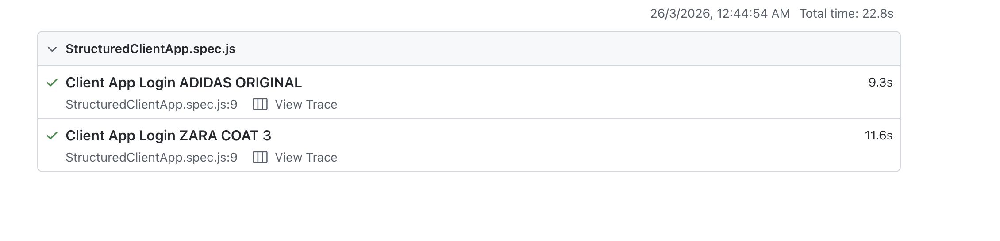
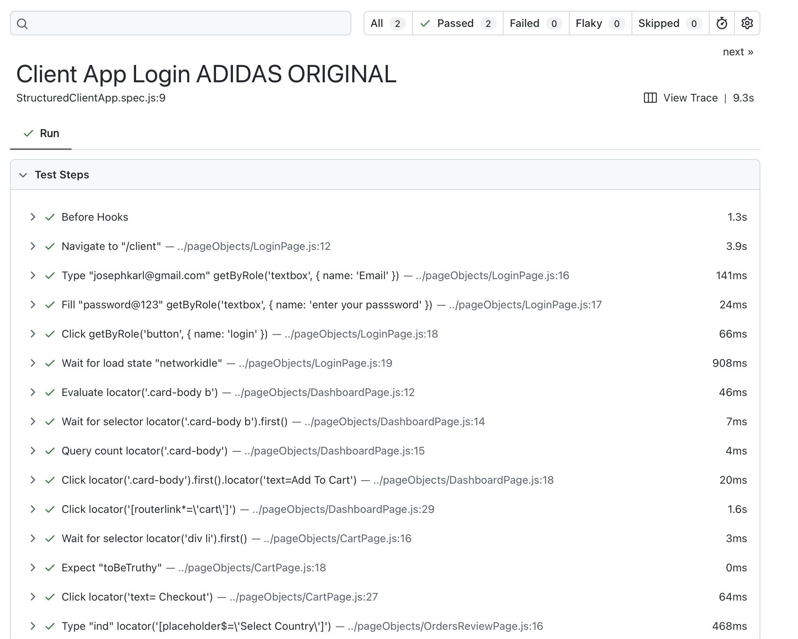
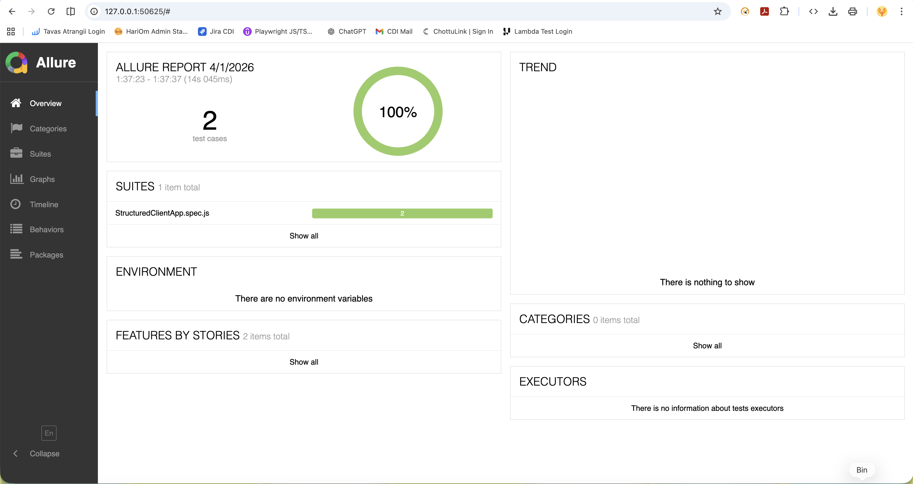
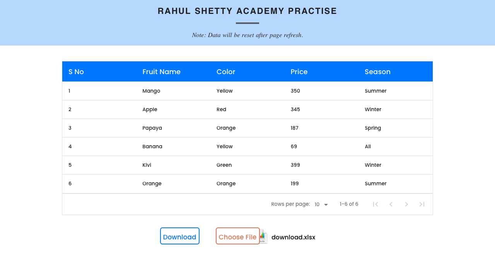
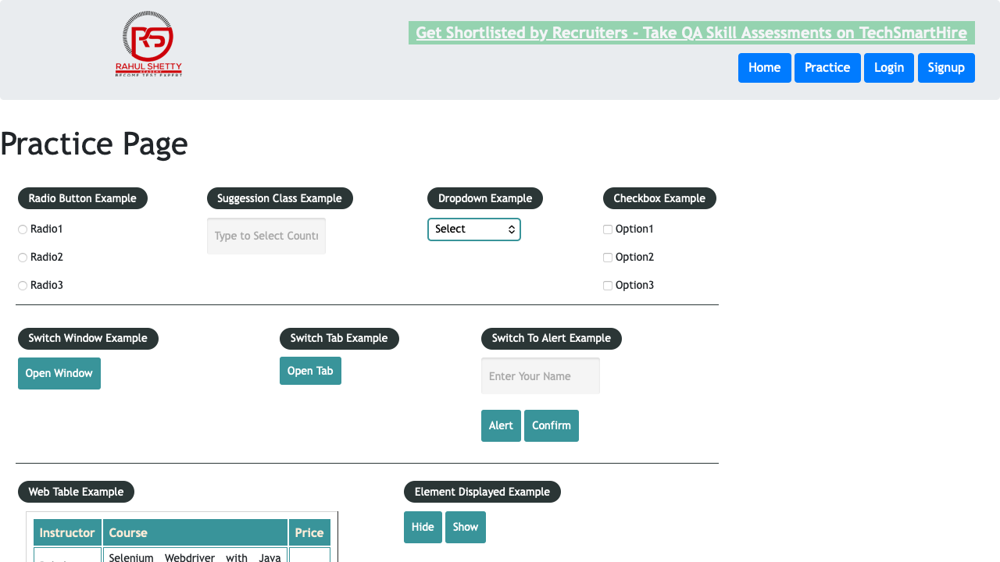
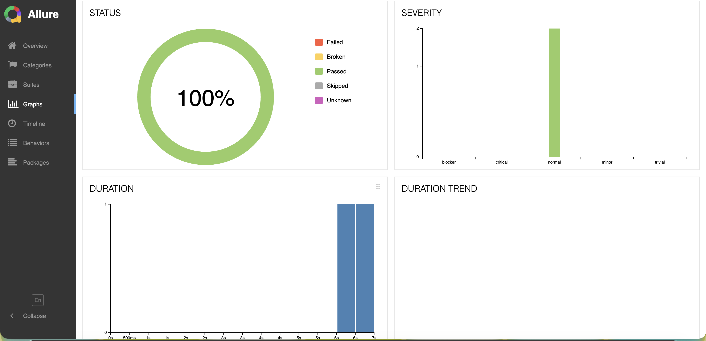
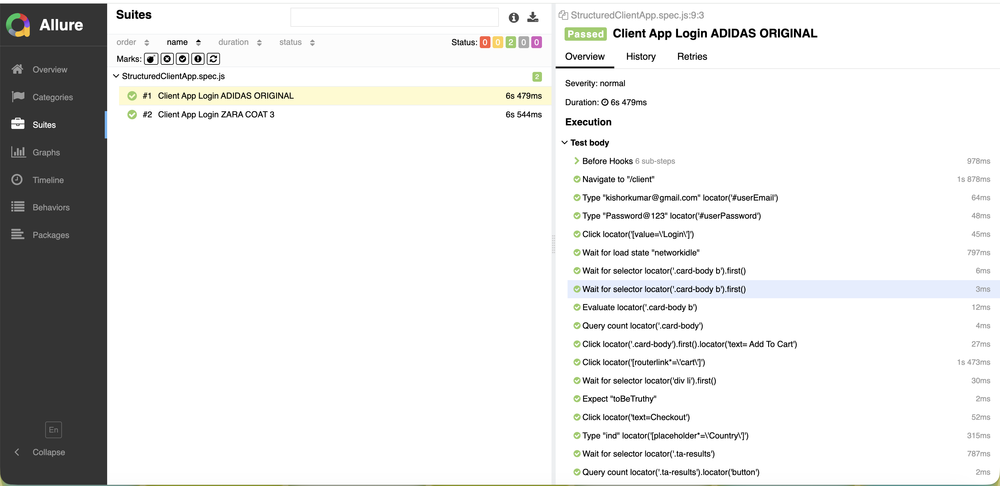

# 🚀 Playwright Automation Framework (POM + Excel Data-Driven + CI)

A scalable **end-to-end test automation framework** built using Playwright with support for **data-driven testing using Excel**, **Page Object Model (POM)**, and **CI/CD integration**. Perfect for testing applications with multiple test scenarios and data variations.

---

## 🎯 Why This Framework?

This framework solves common automation challenges:
- **Data-Driven Testing**: Test the same scenario with multiple data sets (e.g., different user credentials)
- **Maintainability**: Page Object Model ensures UI changes only need updates in one place
- **Scalability**: Clean folder structure makes adding new tests easy
- **CI/CD Ready**: Automated test execution in GitHub Actions

---

## 🔥 Key Features

| Feature | Description |
|---------|-------------|
| ✅ **Data-driven testing** | Uses ExcelJS to read test data from Excel files, allowing easy test data management |
| ✅ **Page Object Model (POM)** | Encapsulates page elements and actions for better code reusability |
| ✅ **Cross-browser testing** | Supports Chromium, Firefox, and WebKit with same test scripts |
| ✅ **Reusable utilities** | Excel readers, wait helpers, and common functions in `utils/` folder |
| ✅ **HTML Reporting** | Built-in Playwright HTML reports for easy test result visualization |
| ✅ **CI/CD ready** | GitHub Actions workflow configured for automated test execution |
| ✅ **Clean architecture** | Well-organized folder structure for long-term maintainability |

---

## 📸 Test Execution Screenshots

| Test Execution | Test Results | Allure Report |
|----------------|--------------|---------------|
|  |  |  |

| Sample Reports |
|----------------|
|  |
|  |
|  |
|  |

---

## 📋 Prerequisites

Before you begin, ensure you have the following installed:

- **Node.js** (v14 or higher) - [Download](https://nodejs.org/)
- **npm** (comes with Node.js) or **yarn** package manager
- **Git** for cloning the repository

---

## ⚡ Quick Start Guide

### 1️⃣ Clone the Repository
```bash
git clone https://github.com/ankitaloni369/PlayWrightAutomation.git
cd PlayWrightAutomation
```

## 2️⃣ Install Dependencies

```bash
npm install
```
This installs:

Playwright test runner
ExcelJS (for Excel data handling)
Allure reporter (optional)
Other required dependencies

## 3️⃣ Install Playwright Browsers

```bash
npx playwright install
```
Downloads Chromium, Firefox, and WebKit browsers for testing.

## 4️⃣ Run Tests

``` bash
# Run all tests
npx playwright test

# Run specific test file
npx playwright test tests/WebAPITest.spec.js

# Run tests in headed mode (see browser UI)
npx playwright test --headed

# Run tests with specific browser
npx playwright test --project=chromium
```

## 📂 Project Structure Explained
```bash
PlayWrightAutomation/
│
├── tests/                      # Test specifications
│   ├── WebAPITest.spec.js      # Example test file
│   └── login.spec.js           # Login test scenarios
│
├── pages/                      # Page Object Models (POM)
│   ├── LoginPage.js            # Login page elements & methods
│   ├── HomePage.js             # Home page elements & methods
│   └── BasePage.js             # Common page methods (base class)
│
├── utils/                      # Utility/Helper functions
│   ├── excelUtils.js           # Excel read/write operations
│   ├── waitHelpers.js          # Custom wait functions
│   └── testDataHelper.js       # Test data processing
│
├── test-data/                  # Test data files
│   ├── loginData.xlsx          # Excel file with test credentials
│   └── testData.json           # Optional JSON test data
│
├── allure-results/             # Allure test results (generated)
├── test-results/               # Playwright test results
├── playwright-report/          # HTML report location
│
├── playwright.config.js        # Playwright configuration
├── package.json                # Dependencies & scripts
└── .github/workflows/          # GitHub Actions CI/CD
    └── playwright.yml          # CI workflow configuration
```
## 🧪 Data-Driven Testing Example
### | Excel File Structure (test-data/loginData.xlsx) | 
|    Username	 |    Password	| ExpectedResult
|----------------|--------------|---------------|
|user1@example.com|	 Pass123	|     success   |
|user2@example.com|	 Pass456	|     success   |
|invalid@example.com|	 wrong	|     failure   |


## Test Implementation
```bash
// Import Excel utility
const { getExcelData } = require('../utils/excelUtils');

// Read test data from Excel
const testData = await getExcelData('loginData', 'Sheet1');

// Create tests dynamically for each data row
for (const data of testData) {
    test(`Login Test - ${data.Username}`, async ({ page }) => {
        const loginPage = new LoginPage(page);
        await loginPage.navigate();
        
        const result = await loginPage.login(
            data.Username, 
            data.Password
        );
        
        if (data.ExpectedResult === 'success') {
            await expect(result).toBeTruthy();
        } else {
            await expect(result).toBeFalsy();
        }
    });
}
```
## 📊 Reporting
### Generate and View Reports
```bash
# After test execution, generate HTML report
npx playwright show-report

# For Allure reporting
npm run allure:generate   # Generate Allure report
npm run allure:open       # Open in browser
```
#### Reports show:

 + Passed/Failed test counts
 + Test execution times 
 + Screenshots on failure
 + Error stack traces
 + Browser & device information

## 🔄 CI/CD Integration
### GitHub Actions Workflow (.github/workflows/playwright.yml)
```bash
name: Playwright Tests
on:
  push:
    branches: [ main, master ]
  pull_request:
    branches: [ main, master ]
jobs:
  test:
    runs-on: ubuntu-latest
    steps:
      - uses: actions/checkout@v3
      - uses: actions/setup-node@v3
      - run: npm ci
      - run: npx playwright install --with-deps
      - run: npx playwright test
```
## 🛠️ Custom Scripts

| Command | 	Description           |
|---------|---------------------------|
|npm test |	Run all tests in headed mode
|npm run allure:generate |	Generate Allure report from results
|npm run allure:open |	Open Allure report in browser

## 🐛 Troubleshooting
### Issue: Tests fail with "Browser not found"
```bash
npx playwright install
```
### Issue: Excel file not found

 + Ensure test-data/ folder exists with Excel files
 + Check file path in excelUtils.js

### Issue: Tests timeout
```bash
#// Increase timeout in playwright.config.js 
timeout: 60000,  #// 60 seconds
```
## 🤝 Contributing
1. Fork the repository
2. Create feature branch: git checkout -b feature/amazing-feature
3. Commit changes: git commit -m 'Add amazing feature'
4. Push: git push origin feature/amazing-feature
5. Open Pull Request

## 👩‍💻 Author
 ``` bash 
 Ankit Aloni 
```
 ``` bash
  GitHub: @ankitaloni369
```
## 📚 Resources & References
+ Playwright Documentation
+ ExcelJS Documentation
+ Page Object Model Pattern
+ GitHub Actions Documentation

## 🎉 Acknowledgments

+ Playwright team for excellent testing framework
+ Open source community for valuable tools
+ All contributors and users of this framework

## ⭐ Support
### If you find this framework useful, please give it a ⭐ on GitHub!


