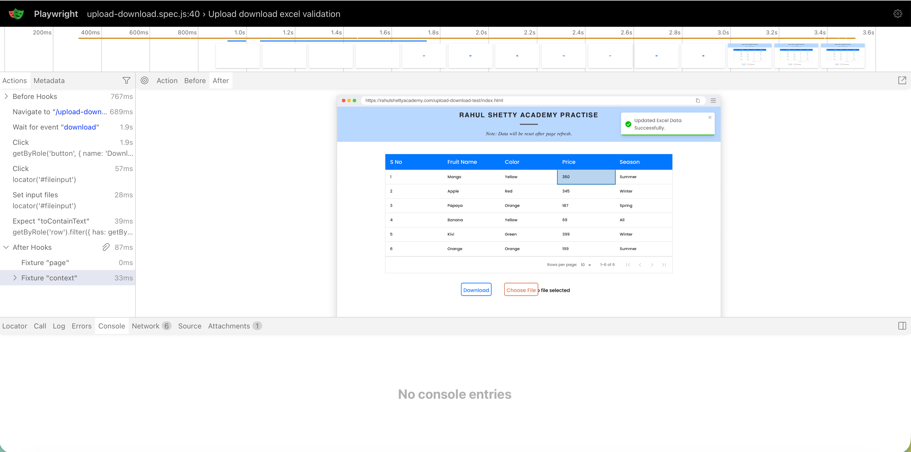

# 🚀 Playwright Automation Framework (POM + Excel Data-Driven + CI)

A scalable **end-to-end test automation framework** built using Playwright with support for **data-driven testing using Excel**, **Page Object Model (POM)**, and **CI/CD integration**.

---

## 🔥 Key Features

* ✅ Data-driven testing using Excel (ExcelJS)
* ✅ Page Object Model (POM) architecture
* ✅ Cross-browser testing (Chromium, Firefox, WebKit)
* ✅ Reusable utilities & helpers
* ✅ HTML Reporting (built-in Playwright reports)
* ✅ CI/CD ready (GitHub Actions)
* ✅ Clean and scalable folder structure

---

## 📸 Demo




---

## ⚡ Quick Start

```bash
git clone https://github.com/ankitaloni369/PlayWrightAutomation.git
cd PlayWrightAutomation
npm install
npx playwright test
```

---

## 📂 Project Structure

```
.
├── tests/                # Test specs
├── pages/                # Page Object Models
├── utils/                # Excel & helper utilities
├── test-data/            # Excel files
├── playwright.config.js  # Playwright config
├── .github/workflows/    # CI setup
```

---

## 🧪 Example Test (Data-Driven)

```js
const testData = await getExcelData("Sheet1");

for (const data of testData) {
    test(`Login Test - ${data.username}`, async ({ page }) => {
        await loginPage.login(data.username, data.password);
    });
}
```

---

## 📊 Reporting

After execution:

```bash
npx playwright show-report
```

---

## 🔄 CI/CD Integration

This project uses **GitHub Actions** to run tests on every push.

---

## 🎯 Use Cases

* E-commerce testing
* Login flows
* API + UI combined testing
* Regression suites

---

## 🤝 Contributing

Feel free to fork, raise issues, and contribute improvements.

---

## ⭐ Support

If you find this useful, give it a ⭐ on GitHub!
